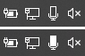
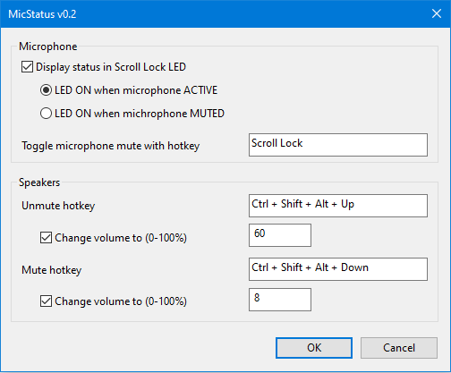

# MicStatus - Show and control microphone and speakers mute status

This tool shows the default microphone mute status, and well as controls the default microphone and speakers mute status with hotkeys.

- The **Scroll Lock LED** on the keyboard is on when the microphone is active and off when it's muted.
  - LED status can be reversed (on when muted, off when active).
- **Tray icon** shows microphone mute status.
- Pressing the Scroll Lock key **toggles microphone** mute status.
- **Speakers** can be muted and unmuted with a hotkey
  - Optionally, **volume** can be set when muting/unmuting.
- All **hotkeys** are configurable.

## Download

Download `MicStatus.exe` from the [Releases](https://github.com/alandau/MicStatus/releases) page.

## Screenshots

Tray icon when microphone muted and active, respectively:

Settings:

## System Requirements

Tested on Windows 10 21H2 64-bit.

In theory it should work on previous versions of Windows 10 and on Windows 7 64-bit too, but this hasn't been tested.
If recompiled as a 32-bit executable, it should also work on 32-bit Windows versions.

## License

MIT
